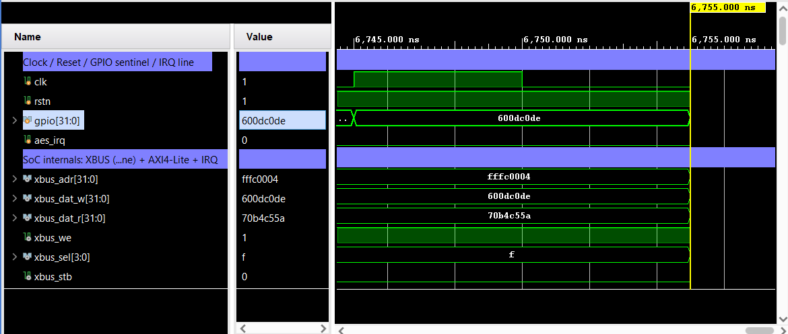
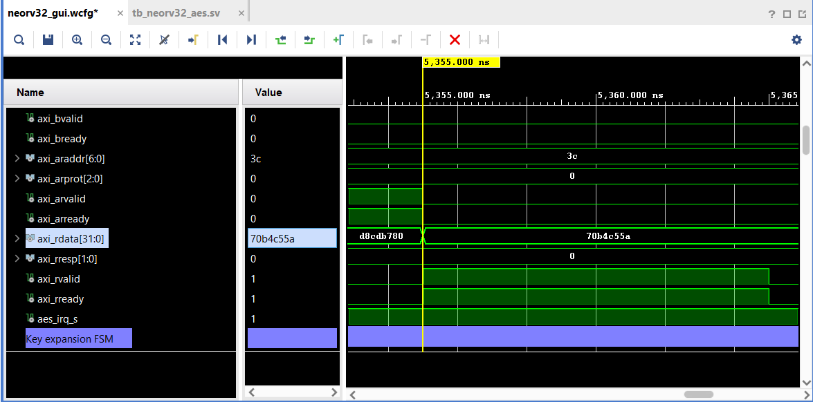
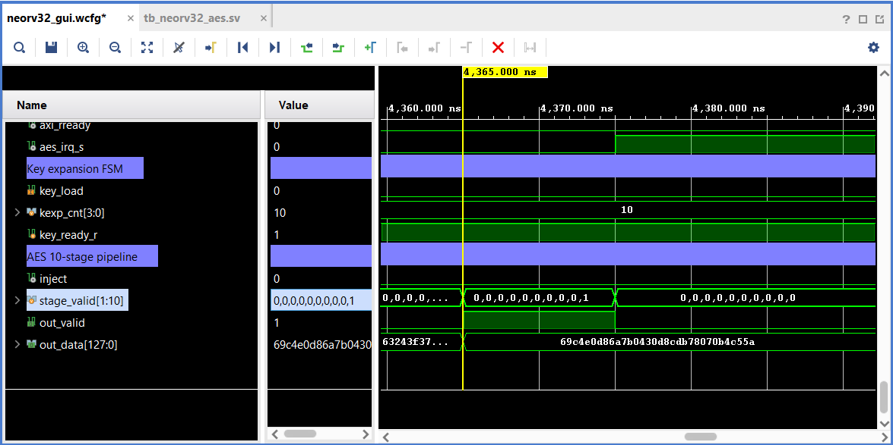

# AES-128 Coprocessor on a Real RISC-V (NEORV32)

This document describes the end-to-end integration of the AES-128 pipelined
coprocessor with an **actual RISC-V core** (NEORV32), driven by **compiled
firmware** in simulation. It is the literal version of the "RISC-V integrated"
goal: earlier phases (Approach A / B) verified the AES peripherals against bus
*models* (BFMs); here a real RV32 core executes real instructions that drive the
AES hardware over a real bus and reads back the NIST-correct ciphertext.

> Result: `*** PASS *** at cycle 472` - the CPU encrypts a block on the hardware
> AES pipeline and the ciphertext matches the FIPS-197 Appendix C.1 known answer.

---

## 1. Architecture

```
   +-----------------+   XBUS (Wishbone b4)   +-------------+   AXI4-Lite   +------------------+
   |   neorv32_top   |----------------------->| wb_to_axil  |-------------->|    aes_coproc    |
   |  (RV32I core)   |<-----------------------|  (bridge)   |<--------------|  (AXI4-Lite slv) |
   |  boots IMEM img |        ack / rdata     +-------------+   bresp/rdata |  10-stage AES    |
   +-----------------+                                                      +------------------+
          |  gpio_o[31:0]  ->  PASS/FAIL sentinel (watched by the testbench)
```

- **`neorv32_top`** (VHDL, NEORV32 v1.13.2): base `rv32i_zicsr_zifencei`,
  internal IMEM (boots a pre-initialized image, no bootloader) and DMEM, the
  external bus (XBUS) enabled, and a 32-bit GPIO output port.
- **`wb_to_axil.v`** (Verilog): NEORV32's external bus is Wishbone; the
  coprocessor is AXI4-Lite. This bridge translates single 32-bit transfers so
  the **AES block is reused unchanged**.
- **`aes_coproc.v`** (Verilog): the existing AXI4-Lite memory-mapped AES
  coprocessor wrapping the 10-stage pipelined core.

The whole thing is **mixed-language**: NEORV32 is VHDL, the AES + bridge are
Verilog, instantiated as components in the VHDL SoC top and bound by name during
elaboration.

### SoC top (`rtl/neorv32_aes_soc.vhd`)

Instantiates `neorv32_top` with these non-default generics:

| Generic            | Value        | Why                                            |
|--------------------|--------------|------------------------------------------------|
| `CLOCK_FREQUENCY`  | `100_000_000`| 100 MHz simulation clock                       |
| `BOOT_MODE_SELECT` | `2`          | Boot directly from the pre-initialized IMEM image (no bootloader/UART handshake in sim) |
| `IMEM_EN` / `IMEM_SIZE` | `true` / `16K` | Internal instruction memory (holds the firmware image) |
| `DMEM_EN` / `DMEM_SIZE` | `true` / `8K`  | Internal data memory (stack + locals)   |
| `XBUS_EN`          | `true`       | External bus for the coprocessor               |
| `IO_GPIO_NUM`      | `32`         | GPIO output for the PASS/FAIL sentinel         |

---

## 2. Address map

The coprocessor lives on the external bus (XBUS claims any address outside
internal IMEM `0x0000_0000`, DMEM `0x8000_0000`, and IO `0xFFE0_0000+`).

| Region              | Address        | Notes                                    |
|---------------------|----------------|------------------------------------------|
| AES coprocessor     | `0x9000_0000`  | Bridge uses the low 7 address bits as the register offset; the base is decoded by XBUS |
| GPIO `PORT_OUT`     | `0xFFFC_0004`  | NEORV32 GPIO output register (sentinel)   |

Coprocessor register offsets (from `aes_coproc.v`, relative to `0x9000_0000`):

| Offset | Reg     | Access | Meaning                                                 |
|--------|---------|--------|---------------------------------------------------------|
| `0x00` | CTRL    | W      | bit0 PUSH, bit1 POP, bit2 KEY_LOAD, bit3 FLUSH          |
| `0x04` | STATUS  | R      | bit3 out_empty, bit4 key_ready, bit5 busy, ...          |
| `0x10` | KEY0..3 | W      | `KEY0 = key[127:96]`                                    |
| `0x20` | DIN0..3 | W      | `DIN0 = plaintext[127:96]`                              |
| `0x30` | DOUT0..3| R      | `DOUT0 = ciphertext[127:96]` (FIFO head)                |

---

## 3. Firmware (`sw/aes_demo/main.c`)

Bare-metal, raw MMIO (no NEORV32 BSP). The sequence:

1. Write the 4 key words, pulse `CTRL.KEY_LOAD`, spin on `STATUS.key_ready`.
2. Write the 4 plaintext words, pulse `CTRL.PUSH`.
3. Spin while `STATUS.out_empty` is set (wait for a result).
4. Read the 4 ciphertext words, pulse `CTRL.POP`.
5. Compare against the FIPS-197 C.1 known answer.
6. Write a sentinel to GPIO and halt.

FIPS-197 Appendix C.1 vector used:

```
key = 000102030405060708090a0b0c0d0e0f
pt  = 00112233445566778899aabbccddeeff
ct  = 69c4e0d86a7b0430d8cdb78070b4c55a
```

Sentinels on GPIO: `0x600DC0DE` = PASS, `0xBAD00000` = FAIL, `0x0` = running.

### IRQ-driven variant (`sw/aes_demo/main_irq.c`)

Instead of polling STATUS, this variant uses the coprocessor's interrupt. The
coprocessor `irq` output is wired in `neorv32_aes_soc.vhd` to the RISC-V
machine-external interrupt input (`irq_mei_i` on `neorv32_top`). The firmware:

1. programs the key, enables `IRQ_EN` (offset `0x08`),
2. sets `mtvec` (direct mode) to a trap handler, enables `mie.MEIE` + `mstatus.MIE`,
3. pushes the block, then `WFI`-sleeps until the interrupt arrives,
4. in the ISR: reads `DOUT0..3`, pulses `POP` (which empties the output FIFO and
   so deasserts the level-sensitive `irq` - the handler self-clears), sets a flag,
5. on wake, checks the ciphertext and drives the GPIO sentinel.

Build/run it through the same flow by pointing `FW_SRC` at it:

```bash
FW_SRC=sw/aes_demo/main_irq.c bash run_neorv32.sh
```

Both variants pass: polling finishes at cycle 472, IRQ-driven at cycle 676 (the
extra cycles are interrupt setup + WFI wake + trap entry/exit). Since the done
flag is set *only* by the ISR, a PASS proves the interrupt fired.

---

## 4. Prerequisites (external to this repo)

Both live outside the repo; `run_neorv32.sh` takes their paths from the
`NEORV32_HOME` and `RISCV_DIR` environment variables (with defaults baked in).

| Dependency            | Version   | Default location                                   |
|-----------------------|-----------|----------------------------------------------------|
| NEORV32               | v1.13.2   | `~/Desktop/neorv32` (`git clone --depth 1 https://github.com/stnolting/neorv32`) |
| RISC-V GCC (xPack)    | 15.2.0    | `~/tools/xpack-riscv-none-elf-gcc-15.2.0-1` (portable zip, extract - no installer) |
| Vivado xsim           | 2024.1    | `/c/Xilinx/Vivado/2024.1`                          |

> `make` is **not** required: `run_neorv32.sh` replicates NEORV32's image build
> by hand. Native `gcc` (MinGW, used elsewhere in this project) builds the
> host-side `image_gen`.

---

## 5. Build and run

From the project root, in Git Bash:

```bash
bash run_neorv32.sh
```

What it does (six steps):

1. **Host-compile** NEORV32's `image_gen` with native `gcc`.
2. **Cross-compile + link** the firmware: `riscv-none-elf-gcc`
   (`-march=rv32i_zicsr_zifencei -mabi=ilp32 -Os -nostartfiles`) with NEORV32's
   `crt0.S` and `neorv32.ld`.
3. **`objcopy`** the ELF to a flat binary, then `image_gen -t vhd` to produce
   `neorv32_imem_image.vhd`, copied over `rtl/core/neorv32_imem_image.vhd` in the
   NEORV32 clone (this is exactly what NEORV32's `make install` does).
4. **Compile NEORV32 VHDL** into a library named `neorv32` (`xvhdl --2008`),
   using NEORV32's own `rtl/file_list_soc.f` (correct dependency order), then the
   VHDL SoC top.
5. **Compile** the Verilog AES + bridge and the SV testbench.
6. **Elaborate** (`xelab -L neorv32 -L work work.tb_neorv32_aes`) and **run**.

### Expected output

```
========================================================
  NEORV32 drove the AES coprocessor over XBUS->AXI4-Lite
  ciphertext matches FIPS-197 C.1 known answer
  *** PASS *** (finished at cycle 472)
========================================================
```

---

## 6. Simulation waveform walkthrough (`tb_neorv32_aes`)

This is what the `tb_neorv32_aes` simulation looks like at the signal level - a
real RV32 core executing the compiled firmware and driving the AES over the bus.
Signals referenced are at the SoC-top scope (`/tb_neorv32_aes/dut/*`): the
`xbus_*` Wishbone bus, the `axi_*` AXI4-Lite bus, `aes_irq_s`, plus the AES
pipeline internals under `dut/aes_inst/u_core/*`. The trace below is for the
IRQ-driven firmware (`main_irq.c`), which finishes at **cycle 676** (the polling
variant `main.c` finishes at 472; the difference is interrupt setup + WFI wake +
trap entry/exit).

A standalone, CPU-free version of the same datapath is in `sim/tb_aes_trace.sv`
(a Wishbone master replaces the CPU) - useful for a clean, short waveform.

### Live simulation (Vivado xsim)

The NEORV32 SoC running the IRQ-driven firmware in the Vivado simulator. The
Scope tree confirms the real CPU (`tb_neorv32_aes/dut` = `neorv32_aes_soc`); the
Value column carries the end-of-run state (`gpio = 600dc0de` = PASS sentinel,
`xbus_dat_r = 70b4c55a`), and the Tcl console reports
`*** PASS *** (finished at cycle 676)`.


*Top group - `clk/rstn`, the `gpio` sentinel, the `aes_irq` line, and the XBUS
(Wishbone) signals the CPU drives. `xbus_adr = fffc0004` is the GPIO write;
`xbus_dat_r = 70b4c55a` is a ciphertext word read back.*


*AXI4-Lite side of the bridge: `axi_araddr` reaches `3c` (the `DOUT3` offset),
`axi_rdata = 70b4c55a` (ciphertext word), and `aes_irq_s` is the coprocessor
interrupt taken by the CPU's machine-external interrupt.*


*Inside the core: the one-time key-expansion FSM (`kexp_cnt -> 10`,
`key_ready_r`) and the 10-stage datapath (`stage_valid[1:10]`,
`out_data = 69c4e0d8...` = the FIPS-197 C.1 ciphertext).*

### Phase-by-phase

| Phase | What you see on the waveform |
|-------|------------------------------|
| **Reset** | `rstn` low, then high. |
| **CPU boot (crt0)** | A quiet stretch with **no `xbus` activity** - the CPU runs startup code (clear BSS, etc.) out of internal IMEM. The AES lives at `0x9000_0000`, off the external bus, so nothing crosses XBUS yet. |
| **Key load** | A cluster of `xbus_stb`/`xbus_ack` **writes** (`xbus_we=1`): four to `KEY0..3` (`xbus_adr` = `0x10..0x1C`) then one to `CTRL` (`0x00`). `key_r` fills in. |
| **Key expansion** | `kexp_cnt` counts **1 -> 10** over 10 cycles; `key_ready_r` then rises. The CPU's STATUS polls (or, for the IRQ firmware, the brief setup) sit around here. |
| **Push a block** | Four `xbus` writes to `DIN0..3` (`0x20..0x2C`) + one `PUSH` to `CTRL`. `din_r` fills, then `inject` pulses and `credits` ticks down. |
| **Encryption** | `inject` -> `stage_valid` shifts a single `1` down all **10 pipeline stages**, one per cycle; exactly 10 cycles later `out_valid` rises and `out_data` = `69c4e0d8 6a7b0430 d8cdb780 70b4c55a`. The CPU is idle (in `WFI`) here - `xbus` goes quiet. |
| **Interrupt** | `aes_irq_s` goes **high** (level = `IRQ_EN & ~out_empty`). The CPU takes the machine-external interrupt; the ISR runs and you see a burst of `xbus` **reads** of `DOUT0..3` (`0x30..0x3C`) followed by a `POP` write -> `aes_irq_s` **drops** (self-clears). |
| **Done** | `gpio` transitions `0x00000000 -> 0x600DC0DE` (the PASS sentinel); the testbench observes it and finishes. |

### Bus vs. compute (measured)

- Each MMIO access (one CPU `sw`/`lw`) is a **4-cycle** Wishbone->AXI4-Lite
  round-trip (stb -> ack), measured directly on `wb_to_axil` + `aes_coproc`.
- One block costs ~10 MMIO transfers in/out (4x DIN + PUSH + 4x DOUT + POP) ~=
  **40+ bus cycles**, versus the **10-cycle** hardware encryption.
- So on the waveform the encryption is a tiny burst in the middle, flanked by
  long stretches of bus handshaking: **feeding dominates compute** for the
  coprocessor path. This is exactly why the streaming DMA (Approach B) exists -
  it removes the CPU/MMIO from the data path so the pipeline runs at its true
  1 block/cycle.

### Reopening the waveform

One command builds, elaborates with debug symbols, and opens the GUI with the
signals already grouped (layout in `sim/neorv32_wave.tcl`):

```bash
bash run_neorv32_gui.sh                                # polling firmware
FW_SRC=sw/aes_demo/main_irq.c bash run_neorv32_gui.sh  # IRQ-driven firmware
```

---

## 7. Gotchas (and how they were solved)

| Problem | Cause | Fix |
|---------|-------|-----|
| `make` not installed | minimal Windows env | Hand-rolled the six build steps in `run_neorv32.sh` |
| Bus mismatch | NEORV32 speaks Wishbone (XBUS); coprocessor speaks AXI4-Lite | `wb_to_axil.v` bridge; the coprocessor asserts AWREADY/WREADY together, so the bridge drives AW+W simultaneously |
| `xelab` printed usage / no snapshot | `--2008` is an `xvhdl` flag, not an `xelab` flag | Drop `--2008` from `xelab` (language is inferred per unit) |
| Wrong generic names | v1.13 renamed memory generics | Use `IMEM_EN`/`IMEM_SIZE`/`DMEM_EN`/`DMEM_SIZE` (not `MEM_INT_*`) |
| Library resolution | NEORV32 sources hard-code `library neorv32` | Compile all NEORV32 VHDL with `xvhdl --work neorv32` |

---

## 8. Files

| File                          | Role                                              |
|-------------------------------|---------------------------------------------------|
| `rtl/neorv32_aes_soc.vhd`     | SoC top: NEORV32 + bridge + coprocessor (VHDL)    |
| `rtl/wb_to_axil.v`            | Wishbone-b4 -> AXI4-Lite bridge                   |
| `sw/aes_demo/main.c`          | Bare-metal firmware (polling, CPU drives AES via MMIO) |
| `sw/aes_demo/main_irq.c`      | IRQ-driven firmware variant (ISR + WFI)           |
| `sim/tb_neorv32_aes.sv`       | Testbench (clocks the SoC, watches GPIO sentinel) |
| `sim/tb_aes_trace.sv`         | CPU-free trace bench (Wishbone master) for clean waveforms |
| `run_neorv32.sh`              | Build firmware + run the mixed-language sim       |
| `run_neorv32_gui.sh`          | Build + open the SoC waveform in the xsim GUI     |
| `sim/neorv32_wave.tcl`        | Pre-grouped waveform layout for the GUI           |

Reused unchanged: `rtl/aes_coproc.v`, `rtl/aes_pipeline_top.v`, `rtl/aes_round.v`,
`rtl/aes_key_expand.v`, `rtl/aes_sbox.v`.
